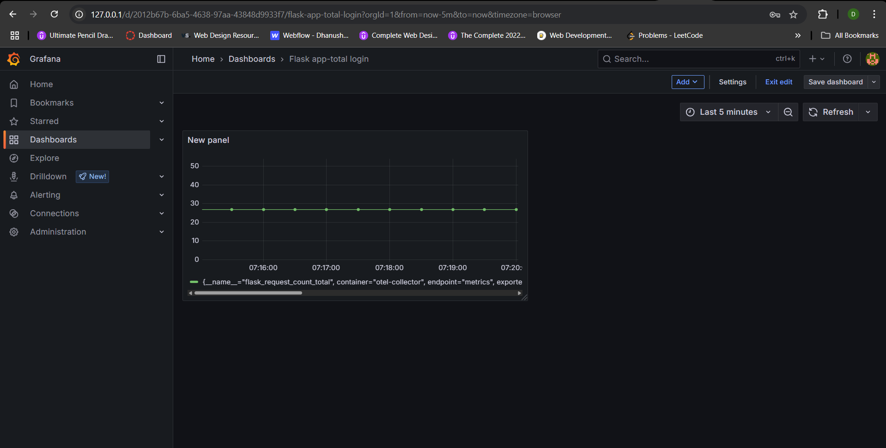

## A Flask app with end-to-end monitoring

### Setup:
1. Multi-node cluster using kind.
2. helm cli for installing prometheus stack
3. Flask app that sends the metric

### Components
1. **Flask app**  
Simple flask REST API app.  
The app uses `opentelemetry` to send the metrics. The metrics `flask_request_count_total` is of type counter which gives the total numbers of requests to the home page.

2. **Prometheus stack**
The prometheus stack is installed using `helm`.

3. **Grafana dashboard**
Grafana is installed as part of prometheus stack. The dashboard is created for visualizing the metrics `flask_request_count_total`.

